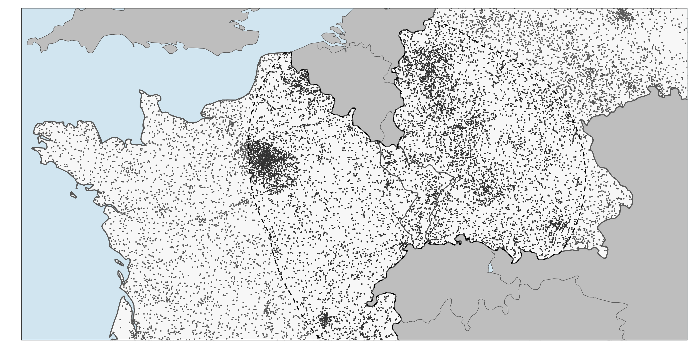

My dissertation explores the impact of international border changes on the formation and transformation of national identities. It proposes a theory of how individuals affected by border change might be incentivized to assimilate into the core nation of the new state. Modern territorial states often enforce homogenization policies that create status hierarchies among ethnic groups. Consequently, minority individuals might adopt cultural and linguistic traits associated with the dominant group to enhance their opportunities and reduce discrimination. As state borders shift, territories with ethnically mixed populations face new incentives to display different ethnonational traits, fostering assimilation into the new state's core group.

The empirical analysis covers Europe between 1816 and 1938, employing quasi-experimental methods to estimate the effects of border changes on national identities. Using novel datasets of historical book publications and of nationalist mobilization, the dissertation demonstrates that new borders create divergence in ethnonational identities, while removed borders lead to convergence. Specifically, elites in transferred territories quickly adapt their publication languages to align with the new state's core group.
The case study of Alsace-Lorraine further illustrates that assimilation efforts are long-lasting but contingent on continued territorial control. The findings challenge the conflict literature's assumption that political violence hardens the boundaries of ethnic groups, suggesting instead that border changes can promote ethnic change through self-interested behavior by local elites.

Overall, the dissertation contributes to understanding the role of international borders in national identity formation, highlighting how border changes influence ethnonational identities and suggesting implications for our understanding of post-conflict societies, and for peace-building policy.
